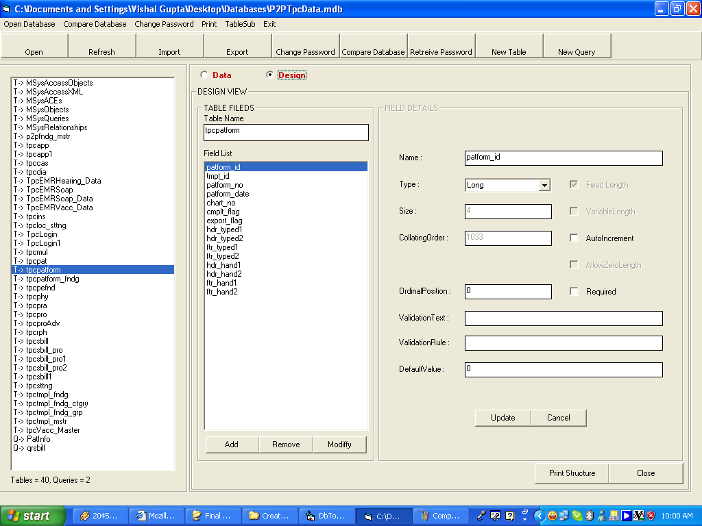



## Database Toolkit

### Description

The main purpose of application is to compare the structure of tables of two access datafiles. Also it facilitate the user in retrieving the database password, change dtaabase password, printing the structure of tables and queries, change the design of tables, running queries, importing and exporting tables and queries and many more...

 
### More Info
 

             |
---                |---
**Submitted On**   |2006-07-27 14:43:54
**By**             |[deepgags](https://github.com/Planet-Source-Code/PSCIndex/blob/master/ByAuthor/deepgags.md)
**Level**          |Advanced
**User Rating**    |4.7 (42 globes from 9 users)
**Compatibility**  |VB 5\.0, VB 6\.0
**Category**       |[Databases/ Data Access/ DAO/ ADO](https://github.com/Planet-Source-Code/PSCIndex/blob/master/ByCategory/databases-data-access-dao-ado__1-6.md)
**World**          |[Visual Basic](https://github.com/Planet-Source-Code/PSCIndex/blob/master/ByWorld/visual-basic.md)
**Archive File**   |[Database\_T1989734252006\.zip](https://github.com/Planet-Source-Code/deepgags-database-toolkit__1-65106/archive/master.zip)

